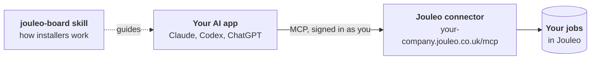

<div align="center">

<a href="https://jouleo.co.uk">
  <picture>
    <source media="(prefers-color-scheme: dark)" srcset="assets/jouleo-logo-dark.svg">
    
  </picture>
</a>

<h3>Agent skills for Jouleo</h3>

<p>Run a solar, battery and EV installer's day from Claude, Codex, ChatGPT and other AI apps.</p>

<p>
  <a href="LICENSE"></a>
  <a href="https://agentskills.io"></a>
  <a href="https://modelcontextprotocol.io"></a>
</p>

<p>
  <a href="#quickstart">Quickstart</a> ·
  <a href="#connect-jouleo">Connect Jouleo</a> ·
  <a href="#whats-included">What's included</a> ·
  <a href="#permissions-and-safety">Permissions and safety</a> ·
  <a href="#faq">FAQ</a>
</p>

</div>

---

[Jouleo](https://jouleo.co.uk) is the job tracker and CRM for UK renewable installers. This repository holds the skills that teach your AI app how an installer's day runs in Jouleo, so it can work alongside you on your real jobs:

- **"What needs doing today?"** — overdue deadlines, open flags, drafts waiting for approval and the next three days of surveys and installs, in a sensible order.
- **"Add this email as an enquiry."** — reads the message, looks up the address, asks only for what's missing, and creates the job.
- **"Book the Patel install for next Tuesday."** — checks crew clashes and absences first, then books it.
- **"Why is the Smith job stuck?"** — explains exactly what's missing before it can move to the next stage.

The skill works with the **Jouleo connector**, an [MCP](https://modelcontextprotocol.io) server at your company's own Jouleo address. Your AI app signs in as you and can only do what you can do in Jouleo.

## Quickstart

**1. Install the skill**

```sh
npx skills add helix8-io/jouleo-skills
```

This works with Claude Code, Codex, Cursor and [40+ other agents](https://github.com/vercel-labs/skills). It asks which apps to install into. Using Claude.ai or the Claude desktop app? See [Claude.ai and the Claude desktop app](#claudeai-and-the-claude-desktop-app).

**2. Connect Jouleo**

Open Jouleo and go to **Connected apps**. Your connector address is at the top, with set-up steps for each app. It looks like this:

```text
https://<your-company>.jouleo.co.uk/mcp
```

**3. Ask**

```text
What needs doing today in Jouleo?
```

> [!TIP]
> Prefer to let your AI app do the work? Paste this into any app that can run commands:
>
> *Set up Jouleo for me: connect the Jouleo MCP server at `<your connector address>` (it signs in with OAuth), then install the Jouleo skill by running `npx skills add helix8-io/jouleo-skills`.*

## Connect Jouleo

Each app connects to your company's own address and signs in with your normal Jouleo account. When you sign in, you choose **Everything I can do** or **Look only**.

| App | Set up |
| --- | --- |
| **Claude** (web, desktop, mobile) | Settings → Connectors → **Add custom connector**. Paste your address, then sign in to Jouleo. |
| **ChatGPT** | Settings → Apps → Advanced settings → turn on **Developer mode**. Create an app with your address and choose OAuth. |
| **Codex** | One line, in a terminal (see below). |
| **Claude Code** | One line, in a terminal (see below). |
| **Other MCP apps** | Add a remote (Streamable HTTP) MCP server with your address. Sign-in uses standard OAuth 2.1 with automatic client registration. |

**Codex** — connect, sign in and install the skill:

```sh
codex mcp add jouleo --url <your-address> \
  && codex mcp login jouleo \
  && npx skills add helix8-io/jouleo-skills -g -a codex -y
```

**Claude Code** — connect for every project and install the skill, then run `/mcp`, choose **jouleo** and **Authenticate**:

```sh
claude mcp add --scope user --transport http jouleo <your-address> \
  && npx skills add helix8-io/jouleo-skills -g -a claude-code -y
```

> [!NOTE]
> ChatGPT doesn't use skill files. It receives the same guidance automatically from the Jouleo connector, so there's nothing extra to install.

### Claude.ai and the Claude desktop app

Download the skill from Jouleo (**Connected apps → Jouleo skill → Download skill**) and upload it in **Settings → Capabilities → Skills**. Team and Enterprise admins can add it for everyone under **Organization settings → Skills**.

## What's included

#### [`jouleo-board`](skills/jouleo-board/SKILL.md)

Runs the day-to-day of an installer's board in Jouleo:

- the daily review, most urgent first;
- turning emails, calls and web forms into complete enquiries;
- booking surveys and installs around crew clashes and absences;
- moving jobs between stages, and explaining exactly what blocks them;
- team changes, notes and archiving.

Try: *"What needs doing today?"* · *"Add this email as an enquiry."* · *"Book the Patel install for next week."*

### How it works



The skill carries the know-how: the order to review a board in, which questions matter for a solar or battery enquiry, how long installs usually take. The connector carries the actions, and every one runs through Jouleo's normal permission checks.

## Permissions and safety

- **It acts as you.** A connection has exactly your permissions in Jouleo, never more. Choose **Look only** for apps or scripts that should only read.
- **Risky actions wait for you.** Archiving a job, posting a note the customer can see, or overriding a stage gate returns a preview first. Nothing changes until you confirm.
- **Customer text is marked.** Anything a customer wrote is passed to the app as information, never as instructions.
- **Everything is logged.** Every action an app takes appears in Jouleo under **Connected apps**, and in the job's history as "via Claude", "via Codex" and so on.
- **You're in control.** Revoke a connection at any time in **Connected apps**. Admins can switch AI apps off for the whole company in **Settings → AI apps**.

## Updating and removing

```sh
npx skills update jouleo-board   # get the latest version
npx skills remove jouleo-board   # remove it
```

## FAQ

<details>
<summary><strong>Do I need a Jouleo account?</strong></summary>
<br>
Yes. The skill works with your company's Jouleo through the Jouleo connector, and you sign in with your own Jouleo account. To find out more, visit <a href="https://jouleo.co.uk">jouleo.co.uk</a>.
</details>

<details>
<summary><strong>Which AI apps are supported?</strong></summary>
<br>
Claude (web, desktop and mobile), Claude Code, ChatGPT with developer mode, Codex, Cursor, and any app that supports remote MCP servers with OAuth. The skill itself installs into any agent that supports the open <a href="https://agentskills.io">Agent Skills</a> format.
</details>

<details>
<summary><strong>Can the AI app see other companies' data?</strong></summary>
<br>
No. Each connection belongs to one person at one company and only works at that company's own Jouleo address.
</details>

<details>
<summary><strong>What happens if someone leaves the company?</strong></summary>
<br>
When an admin disables their Jouleo account, every AI app they connected stops working straight away.
</details>

<details>
<summary><strong>Can I use it in automations?</strong></summary>
<br>
Yes. Sign in once and the connection renews itself until it's revoked. Choose <strong>Look only</strong> for automations that should never change anything.
</details>

## Contributing

Found something the skill gets wrong, or a workflow it should know? [Open an issue](https://github.com/helix8-io/jouleo-skills/issues). The skills follow the [Agent Skills](https://agentskills.io) format: one folder per skill under [`skills/`](skills), each with a `SKILL.md`.

## License

Released under the [MIT License](LICENSE).

---

<div align="center">
<sub>Built by <a href="https://helix8.io">Helix8</a> for the installers using <a href="https://jouleo.co.uk">Jouleo</a>.</sub>
</div>
